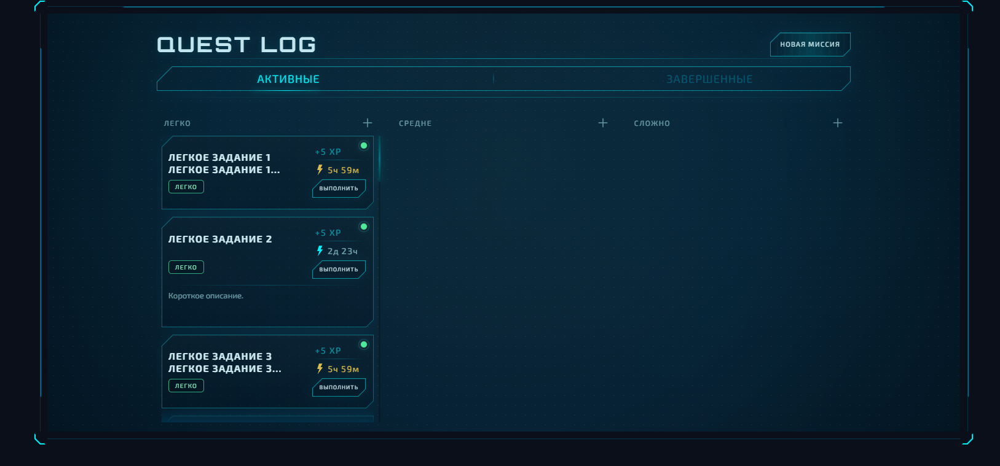
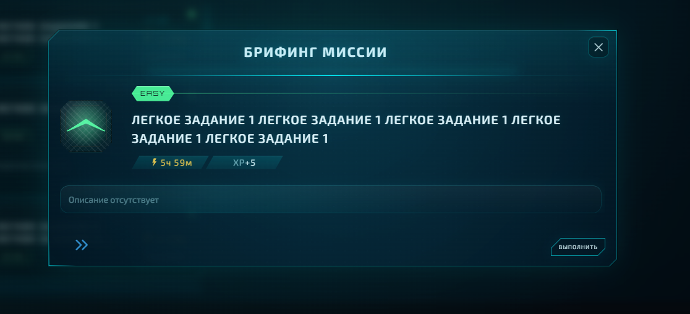

# GamifyShit 🎮💩 (work title)

**Gamified task tracker that turns routine tasks into quests**

## Intro

Gamified task tracking application built with React and TypeScript.
Designed as a productivity tool with game-inspired mechanics such as difficulty levels, XP rewards and a custom quest log interface.

## Preview

## Current features

- Task creation, editing and completion flows

- Difficulty-based task categorization

- Local persistence with custom useLocalStorage hook

- Interactive modal for task management

- Scrollable task board with custom UI styling

## Planned features

- Pomodoro timer

- Energy / stamina mechanics

- Progress tracking and extended gamification systems

## Tech stack

React • TypeScript • SCSS • Vite
